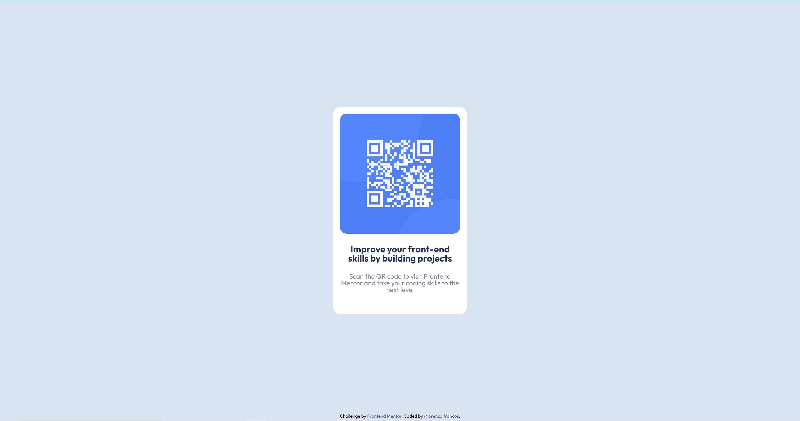

# Frontend Mentor - QR code component solution

This is a solution to the [QR code component challenge on Frontend Mentor](https://www.frontendmentor.io/challenges/qr-code-component-iux_sIO_H). Frontend Mentor challenges help you improve your coding skills by building realistic projects.

## Table of contents

- [Overview](#overview)
  - [Screenshot](#screenshot)
  - [Links](#links)
- [My process](#my-process)
  - [Built with](#built-with)
  - [What I learned](#what-i-learned)
  - [Continued development](#continued-development)
- [Author](#author)

## Overview

### Screenshot

### Links

- Solution URL: [Add solution URL here](https://github.com/Lfrancos/qr-code-component-main)
- Live Site URL: [Add live site URL here](https://lfrancos.github.io/qr-code-component-main/)

## My process

### Built with

- Saas / scss
- CSS custom properties
- CSS Grid

### What I learned

The reality is that this was a pretty simple challenge, it was good to see that I have learned something over the last few months and to be able to do this in half an hour is really encouraging.

### Continued development

Still I'm not sure if I should be using the 'vh' as a mesure for the height, that means that it is giving a constraint height and may be very bad for responsive websites, I need to figure out what is the best way to make that responsive while keeping it in the middle of the screen.

## Author

- Website - [@lorenzo.francos](https://www.lorenzofrancos.com)
- Instagram - [@lorenzo.francos](https://www.instagram.com/lorenzo.francos/?hl=en)
- Github - [@Lfrancos](https://github.com/Lfrancos)
- Frontend Mentor - [@Lfrancos](https://www.frontendmentor.io/profile/Lfrancos)
